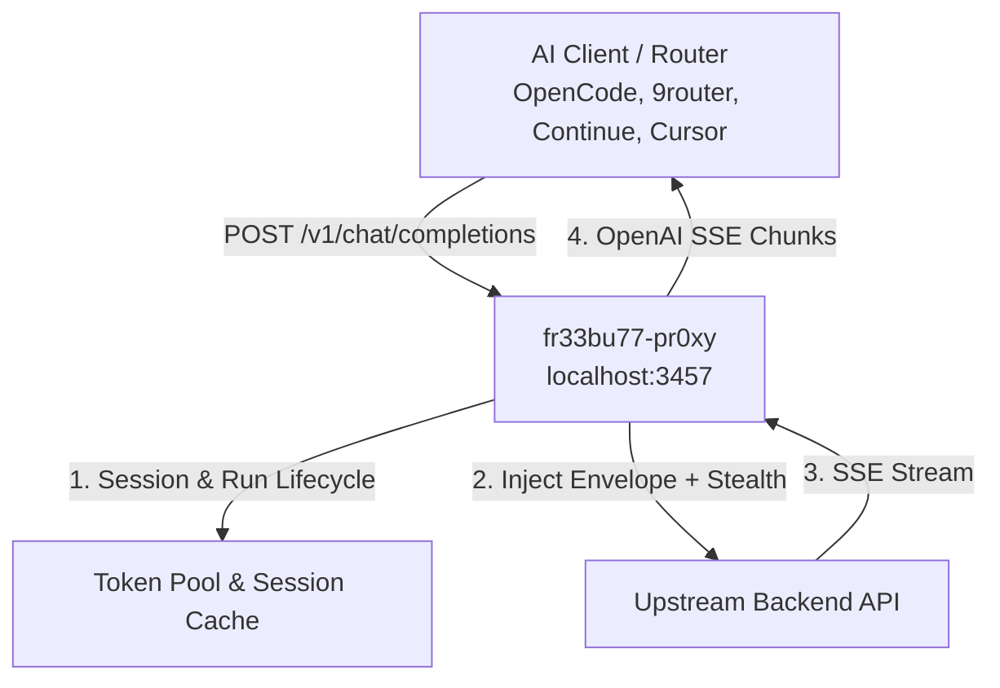

# fr33bu77-pr0xy (Universal AI Gateway & Token Pool)

[](https://github.com/trefeon/freebuff-proxy/actions/workflows/ci.yml)
[](https://github.com/trefeon/freebuff-proxy/releases)
[](https://github.com/trefeon/freebuff-proxy/blob/main/LICENSE)

An OpenAI-compatible high-performance gateway and bridge for coding assistant backends. Connect any standard OpenAI client (Cursor, Continue, aider, OpenCode, 9router, OmniRouter, LiteLLM) to upstream AI agent models with built-in token pooling, session lifecycle management, and TLS stealth.

> **Universal Coding Gateway Architecture.**
> The proxy replicates official CLI request envelopes (including system identity headers, metadata context, model-bound sessions, tool schema normalization, and browser JA3 TLS stealth). Direct OpenAI chat completions and SSE streaming are supported end-to-end.

---

## Features

- **OpenAI-Compatible API**: Serves `/v1/chat/completions`, `/v1/models`, `/healthz`, and Prometheus `/metrics` on `127.0.0.1:3457`.
- **Dynamic Reasoning Effort**: Full support for OpenAI `reasoning_effort` (`low`, `medium`, `high`, `max`) mapped directly to upstream reasoning engines.
- **Session & Run Lifecycle**: Manages upstream session handshakes, model locking recovery (`DELETE` → re-`POST`), and grace draining automatically.
- **Token Pooling & Bridge Mode**:
  - **Pooled Mode**: Comma-separate tokens in `AUTH_TOKENS=tok1,tok2` with automatic round-robin and error failover.
  - **Bridge Mode**: Zero-storage relay when `AUTH_TOKENS` is empty — each client or router sends its own token via `Authorization: Bearer <token>`.
- **TLS Stealth & Egress Proxies**: Supports `HTTP_PROXY`, `SOCKS5_PROXY`, per-token SOCKS5 routing, and browser TLS fingerprinting (Chrome, Firefox, Safari).
- **Subagent-Ready Concurrency**: Single-flight session refresh prevents race conditions during high-volume tool-calling loops.
- **Safe Mode**: Built-in rate limiting and jitter presets to protect upstream account standing.

---

## Architecture Overview



---

## Quick Start

### 1. Configure

Copy the example configuration:

```bash
cp .env.example .env
```

### 2. Obtain an Auth Token

Generate an authentication token using the headless helper (opens a browser OAuth login, prints the token to terminal without saving):

**Windows (PowerShell):**
```powershell
.\scripts\gen-token.ps1 -ToClipboard
```

**Linux / macOS (bash):**
```bash
./scripts/gen-token.sh --clipboard
```

Paste the token into `.env` under `AUTH_TOKENS=...` (or add it directly to your router as a bearer key).

### 3. Run with Docker Compose

```bash
docker compose up -d
```

Check health:
```bash
curl http://127.0.0.1:3457/healthz
```

---

## Client Integration Examples

### 1. OpenCode Direct Integration (`~/.config/opencode/opencode.jsonc`)

Point OpenCode directly at `fr33bu77`:

```json
{
  "$schema": "https://opencode.ai/config.json",
  "model": "fr33bu77/deepseek-flash",
  "small_model": "fr33bu77/deepseek-flash",
  "provider": {
    "fr33bu77": {
      "npm": "@ai-sdk/openai-compatible",
      "name": "fr33bu77 Gateway",
      "options": {
        "baseURL": "http://127.0.0.1:3457/v1",
        "apiKey": "not-needed"
      },
      "models": {
        "deepseek-flash": {
          "id": "deepseek/deepseek-v4-flash",
          "name": "DeepSeek V4 Flash",
          "reasoning": true,
          "tool_call": true,
          "cost": { "input": 0, "output": 0 },
          "limit": { "context": 1000000, "output": 384000 },
          "modalities": { "input": ["text"], "output": ["text"] },
          "variants": {
            "low": { "reasoningEffort": "low" },
            "high": { "reasoningEffort": "high" },
            "max": { "reasoningEffort": "max" }
          }
        },
        "deepseek-pro": {
          "id": "deepseek/deepseek-v4-pro",
          "name": "DeepSeek V4 Pro",
          "reasoning": true,
          "tool_call": true,
          "cost": { "input": 0, "output": 0 },
          "limit": { "context": 1000000, "output": 384000 },
          "modalities": { "input": ["text"], "output": ["text"] },
          "variants": {
            "low": { "reasoningEffort": "low" },
            "high": { "reasoningEffort": "high" },
            "max": { "reasoningEffort": "max" }
          }
        },
        "mimo": {
          "id": "mimo/mimo-v2.5",
          "name": "MiMo 2.5",
          "reasoning": true,
          "tool_call": true,
          "cost": { "input": 0, "output": 0 },
          "limit": { "context": 1000000, "output": 128000 },
          "modalities": {
            "input": ["text", "image", "video", "audio"],
            "output": ["text"]
          },
          "variants": {
            "none": { "reasoningEffort": "none" },
            "high": { "reasoningEffort": "high" }
          }
        },
        "minimax-m3": {
          "id": "minimax/minimax-m3",
          "name": "MiniMax M3",
          "reasoning": true,
          "tool_call": true,
          "cost": { "input": 0, "output": 0 },
          "limit": { "context": 1000000, "output": 262144 },
          "modalities": {
            "input": ["text", "image", "video"],
            "output": ["text"]
          }
        }
      }
    }
  }
}
```

---

### 2. OpenCode via 9Router (`~/.config/opencode/opencode.jsonc`)

When routing through **9router** (using leet prefix `fr33bu77`) for multi-account load balancing:

```json
{
  "$schema": "https://opencode.ai/config.json",
  "model": "9router/fr33bu77/deepseek/deepseek-v4-flash",
  "small_model": "9router/fr33bu77/deepseek/deepseek-v4-flash",
  "provider": {
    "9router": {
      "npm": "@ai-sdk/openai-compatible",
      "name": "9Router",
      "options": {
        "baseURL": "http://127.0.0.1:20128/v1",
        "apiKey": "your-9router-api-key"
      },
      "models": {
        "fr33bu77/deepseek/deepseek-v4-flash": {
          "id": "fr33bu77/deepseek/deepseek-v4-flash",
          "name": "fr33bu77 | DeepSeek V4 Flash",
          "reasoning": true,
          "tool_call": true,
          "cost": { "input": 0, "output": 0 },
          "limit": { "context": 1000000, "output": 384000 },
          "modalities": { "input": ["text"], "output": ["text"] },
          "variants": {
            "low": { "reasoningEffort": "low" },
            "high": { "reasoningEffort": "high" },
            "max": { "reasoningEffort": "max" }
          }
        },
        "fr33bu77/mimo/mimo-v2.5": {
          "id": "fr33bu77/mimo/mimo-v2.5",
          "name": "fr33bu77 | MiMo 2.5",
          "reasoning": true,
          "tool_call": true,
          "cost": { "input": 0, "output": 0 },
          "limit": { "context": 1000000, "output": 128000 },
          "modalities": {
            "input": ["text", "image", "video", "audio"],
            "output": ["text"]
          },
          "variants": {
            "none": { "reasoningEffort": "none" },
            "high": { "reasoningEffort": "high" }
          }
        }
      }
    }
  }
}
```

---

### 3. Continue (`~/.continue/config.json`)

```json
{
  "models": [
    {
      "title": "DeepSeek V4 Flash",
      "provider": "openai",
      "model": "deepseek/deepseek-v4-flash",
      "apiBase": "http://localhost:3457/v1",
      "apiKey": "not-needed"
    },
    {
      "title": "MiMo 2.5 (Multimodal)",
      "provider": "openai",
      "model": "mimo/mimo-v2.5",
      "apiBase": "http://localhost:3457/v1",
      "apiKey": "not-needed"
    }
  ]
}
```

---

### 4. Aider CLI

```bash
# Run with DeepSeek V4 Flash
aider --openai-api-base http://127.0.0.1:3457/v1 \
      --openai-api-key not-needed \
      --model openai/deepseek/deepseek-v4-flash
```

---

### 5. 9router / OmniRouter Dashboard Setup (Bridge Mode)

1. In the **9router Dashboard** (`http://127.0.0.1:20128`):
   - Go to **Providers** $\rightarrow$ **Add Provider** $\rightarrow$ select **OpenAI Compatible**.
   - **Name**: `fr33bu77`
   - **Prefix**: `fr33bu77`
   - **Base URL**: `http://127.0.0.1:3457/v1` (or `http://host.docker.internal:3457/v1` if in Docker)
   - **API Keys**: Add your upstream auth token(s) as keys (each key acts as a pooled upstream account).
2. 9router handles round-robin and rate-limit fallover across all configured keys under the `fr33bu77/...` model prefix.

---

## Configuration Reference

| Environment Variable | Default | Description |
|---|---|---|
| `LISTEN_ADDR` | `:3457` | Port and host address to bind |
| `AUTH_TOKENS` | `""` | Comma-separated list of upstream tokens (empty = bridge mode) |
| `SAFE_MODE` | `true` | Enables conservative message limits and request jitter |
| `MAX_MESSAGES_PER_DAY` | `150` | Daily request ceiling per token |
| `SOCKS5_PROXY` | `""` | Outbound proxy for upstream requests |
| `TLS_FINGERPRINT` | `auto` | TLS profile: `auto`, `chrome126`, `firefox128`, `safari18` |
| `LOG_LEVEL` | `info` | Log verbosity: `debug`, `info`, `warn`, `error` |

---

## License

[MIT](LICENSE)
