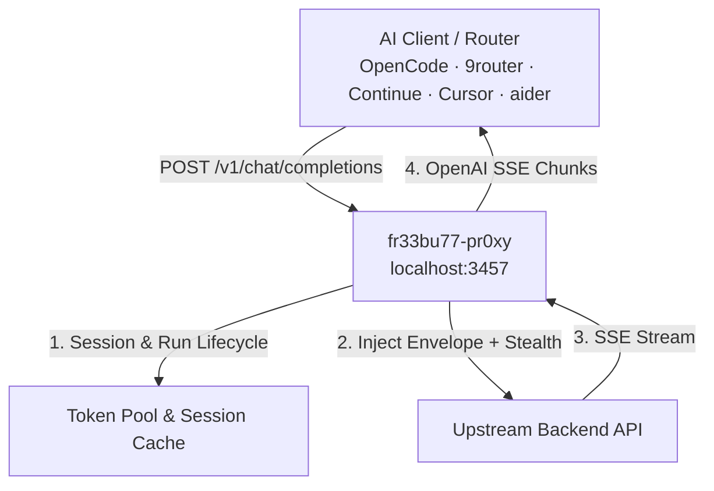

# fr33bu77-pr0xy (AI Gateway & Token Pool)

[](https://github.com/trefeon/freebuff-proxy/actions/workflows/ci.yml)
[](https://github.com/trefeon/freebuff-proxy/releases)
[](https://github.com/trefeon/freebuff-proxy/blob/main/LICENSE)

An OpenAI-compatible high-performance gateway and bridge for coding assistant backends. Connect any OpenAI-compatible client or router (OpenCode, 9router, Continue, Cursor, aider, OmniRouter, LiteLLM) to upstream AI agent models with built-in token pooling, session lifecycle management, and TLS stealth.
> **Coding Gateway Architecture.**
> The proxy replicates official CLI request envelopes (including system identity headers, metadata context, model-bound sessions, tool schema normalization, and browser JA3 TLS stealth). Direct OpenAI chat completions and SSE streaming are supported end-to-end.
---

## Features

- **OpenAI-Compatible API**: Serves `/v1/chat/completions`, `/v1/models`, `/healthz`, and Prometheus `/metrics` on `127.0.0.1:3457`.
- **Dynamic Reasoning Effort**: Full support for OpenAI `reasoning_effort` (`low`, `medium`, `high`, `max`) mapped directly to upstream reasoning engines.
- **Session & Run Lifecycle**: Manages upstream session handshakes, model locking recovery (`DELETE` → re-`POST`), and grace draining automatically.
- **Token Pooling & Bridge Mode**:
  - **Pooled Mode**: Comma-separate tokens in `AUTH_TOKENS=tok1,tok2` with automatic round-robin and error failover.
  - **Bridge Mode**: Zero-storage relay when `AUTH_TOKENS` is empty — each client or router sends its own token via `Authorization: Bearer <token>`.
- **TLS Stealth & Egress Proxies**: Supports `HTTP_PROXY`, `SOCKS5_PROXY`, per-token SOCKS5 routing, and browser TLS fingerprinting (Chrome, Firefox, Safari).
- **Subagent-Ready Concurrency**: Single-flight session refresh prevents race conditions during high-volume tool-calling loops.
- **Safe Mode**: Built-in rate limiting and jitter presets to protect upstream account standing.

---

## Architecture Overview



---

## Quick Start

### 1. Configure

Copy the example configuration:

```bash
cp .env.example .env
```

### 2. Obtain an Auth Token

Generate an authentication token using the headless helper (opens a browser OAuth login, prints the token to terminal without saving):

**Windows (PowerShell):**
```powershell
.\scripts\gen-token.ps1 -ToClipboard
```

**Linux / macOS (bash):**
```bash
./scripts/gen-token.sh --clipboard
```

Paste the token into `.env` under `AUTH_TOKENS=...` (or add it directly to your router as a bearer key).

### 3. Run with Docker Compose

```bash
docker compose up -d
```

Check health:
```bash
curl http://127.0.0.1:3457/healthz
```

---

## Configuration Reference

| Environment Variable | Default | Description |
|---|---|---|
| `LISTEN_ADDR` | `:3457` | Port and host address to bind |
| `AUTH_TOKENS` | `""` | Comma-separated list of upstream tokens (empty = bridge mode) |
| `SAFE_MODE` | `true` | Enables conservative message limits and request jitter |
| `MAX_MESSAGES_PER_DAY` | `150` | Daily request ceiling per token |
| `SOCKS5_PROXY` | `""` | Outbound proxy for upstream requests |
| `TLS_FINGERPRINT` | `auto` | TLS profile: `auto`, `chrome126`, `firefox128`, `safari18` |
| `LOG_LEVEL` | `info` | Log verbosity: `debug`, `info`, `warn`, `error` |

---

## License

[MIT](LICENSE)
